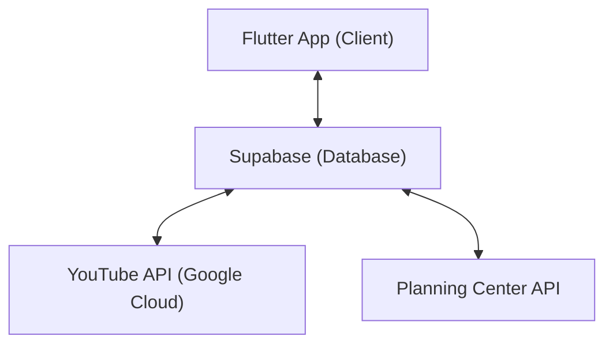

# NorthPoint Mobile
Official mobile app for NorthPoint Church in Muncie, Indiana.
[Official Website](https://www.northpointmuncie.com/)

<br>
## Our system


## Development
To contribute to this project follow these steps:
- Have a working Flutter environment
- Clone this repo
- Get a copy of the .env file from me at jason.yoder2023@gmail.com
- Run ```flutter pub get``` from the root of the repository
- Start programming!
